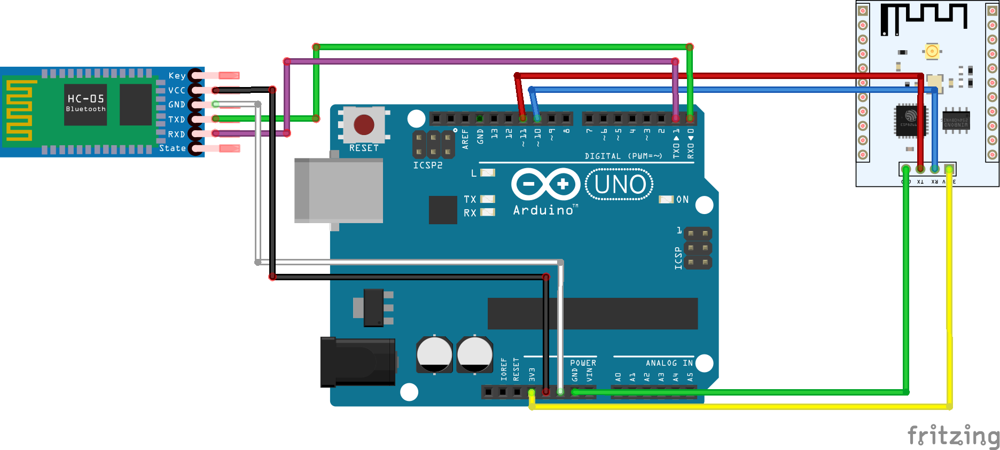

============
设备开发示例
============

此节提供了开发的简单示例，旨在了解如何进行简单的开发。希望可以起到举一反三的作用

安家智能锁
>>>>>>>>>>>>>

概述
:::::::::

用于将实现锁具的智能化

材料清单
:::::::::

1. 子服务器

2. 阴极锁

3. 继电器

4. USB摄像头

5. 小音箱

6. ESP8266 

7. `手机APP <https://github.com/BuddyJoker/SmartLock_project>`_ 

接线图
:::::::::

.. image:: ../_static/RaspberryPiConnectionDiagram.png

图1：树莓派接线图

图2： Arduino接线图

源代码
:::::::::

.. code-block :: c++

    #include <SoftwareSerial.h>

    SoftwareSerial mySerial(10, 11); // RX, TX?Esp8266????

    String copy="";
    String WiFiName="";bool status1=true;//?????true
    String WiFiPasswd="";bool status2=true;
    String Ip="";bool status3=true;
    String Port="";bool status4=true;

    void setup()
    {
    Serial.begin(38400);//???????arduino??rx?tx?
    while (!Serial) {
    ; //????????
    }
    Serial.println("BT is ready!");

    mySerial.begin(38400);// ???????
    mySerial.println("Esp8266 is ready!");
    mySerial.print("AT+CWMODE=1\r\n");//Esp8266??STA????????????
    delay(10);//?????????WiFiName?WiFiPasswd????Ip????Port
    }

    void ConnectWiFi();
    void SingleConnect();
    void CreateTCP();
    void SerialNet();

    void loop() 
    { 
    if (mySerial.available()){//?????esp8266?????
    Serial.write(mySerial.read());
    }
    while (Serial.available()>0){//if(avaiable()) ???????????????????,???????
    copy+=char(Serial.read());
    delay(2);//??????????????
    }
    if(copy.length()>0){
    if(status1){ //?????????????CreateTCP()????TCP??
        WiFiName=copy;
        status1=false;
        copy="";   
    }
    else {
        if(status2){
        WiFiPasswd=copy;
        status2=false;
        copy="";
        ConnectWiFi();
        }
        else{
            if(status3){
            Ip=copy;
            status3=false;
            copy="";
            SingleConnect();
            } 
            else{
                if(status4){
                Port=copy;
                status4=false;
                copy="";            
                CreateTCP(); 
                delay(1000);
                SerialNet();           
                }
                }//end else3       
            }//end else2
    }//end else1
    }//end copy.length()
        delay(10);//??????????????
    }

    void ConnectWiFi(){
    //???WiFi
    mySerial.print("AT+CWJAP=\"");
    mySerial.print(WiFiName);
    mySerial.print("\",\"");
    mySerial.print(WiFiPasswd);
    mySerial.print("\"\r\n");
    delay(10); 
    }

    void SingleConnect(){
    //????????????
    mySerial.print("AT+CIPMUX=0\r\n");
    delay(10);
    mySerial.print("AT+CIPMODE=1\r\n");
    delay(10); 
    }

    void CreateTCP(){
    //?????
    mySerial.print("AT+CIPSTART=\"TCP\",\"");
    mySerial.print(Ip);
    mySerial.print("\",");
    mySerial.print(Port);
    mySerial.print("\r\n");
    delay(10);
    }

    void SerialNet(){
    //??????
    mySerial.print("AT+CIPSEND\r\n");
    delay(10);     
        }

远程控制小灯
>>>>>>>>>>>>>

概述
:::::::::

在这里描述一下这个作品是干什么的

材料清单
:::::::::

1. aaaa

2. bbbbb

3. ccccc

接线图
:::::::::

源代码
:::::::::

.. code-block :: c

    /* LED闪烁进阶

    让13引脚连接的LED闪烁起来而不使用delay()函数。这样就意味着其他的代码可以不受LED闪烁的干扰，在“同一时间”(译者注：其实应该是几乎同一时间)运行。

    电路这样搭:
    * LED连接到13引脚和GND。
    * 注：绝大多数Arduino已经在13引脚连接了板载LED。因而这个例子可能不需要多余LED也能看到效果。

    代码是公开的。
    */

    // 定义一个不会改变的整型常量。这里用来定义引脚号码:
    const int ledPin =  13;      // LED连接的引脚

    // 声明并定义可变的变量 :
    int ledState = LOW;             // LED的状态值

    // 一般来说，用 "unsigned long"类型的变量来存储时间值比较好。因为如果用int类型“装不下”这么大的数字。
    unsigned long previousMillis = 0;        // 存储上次LED状态被改变的时间

    // 又定义了一个常量 :
    const long interval = 1000;           // LED状态应该被改变的间隔时间(单位毫秒)

    void setup() {
    // 将数字引脚定义为输出模式：
    pinMode(ledPin, OUTPUT);
    }

    void loop() {
    //这里写你想要不断运行的代码。

    // 检查看看LED是否到了应该打开或关闭的时间; 就是说，检查下现在时间离开记录的时间是否超过了要求LED状态改变的间隔时间。
        unsigned long currentMillis = millis();

    if (currentMillis - previousMillis >= interval) {
        // 更新时间标记
        previousMillis = currentMillis;

        // 如果LED关闭则打开它，如果LED打开则关闭它:
        if (ledState == LOW) {
        ledState = HIGH;
        } else {
        ledState = LOW;
        }

        // 用以下代码设置LED状态:
        digitalWrite(ledPin, ledState);
    }
    }

示例2
>>>>>>>>>>>>

材料清单
:::::::::

1. aaaa

2. bbbbb

3. ccccc

接线图
:::::::::

.. image:: ../_static/

源代码
:::::::::

.. code-block :: c