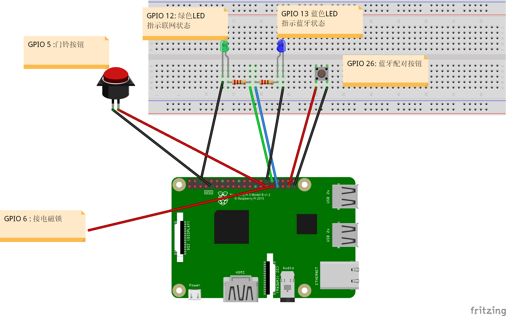

====
开始
====

该文档主要是将本项目从部署到原理进行讲解，作为人生中第一次写文档的练手作品

概述
==================
PrivateSmartHome是一个简易版的物联网家居系统。你可以自己DIY物联网设备，自己进行部署，
实现私有化的同时也可以对设备进行共享，让被授权的其他用户也能操作你的设备。
作为一个智能家居系统它提供了设备远程控制以及传感器数据采集整理的服务。此外系统还整合了人脸识别功能，可以此实现人脸识别开锁功能。

工具及材料
=========
要部署PrivateSmartHome你需要：

* 一台装有UbuntuServer的云服务器
* 一台装有Windows10 IOT Core 的树莓派(Rasperbery Pi 3)
* 手机APP
* 有线音箱（可选）
* USB摄像头（可选）

.. note:: 服务器上需要安装 .net core ，否则就不能部署服务器。音箱用来播放语音提示，USB摄像头可以进行人脸识别

云服务器准备
===========

云服务程序是一个ASP.NET core MVC 项目，不能直接运行所以需要为之搭建运行环境。现假设服务器操作系统为Ubuntu Server 
,以下为部署流程：

1.  `安装 .net core 2.0 <https://www.microsoft.com/net/learn/get-started/linuxubuntu>`_ 
2. `安装反向代理服务器 nginx <http://blog.csdn.net/u014374031/article/details/73441577>`_

.. note:: 这是.net core 官方推荐使用反向代理服务器。在这里Nginx需要同时支持HTTP以及WebSocket且与服务程序部署在一台云服务器。具体配置见博客
 
3. `安装守护进程 supervisor <http://blog.csdn.net/jackghq/article/details/62937208?utm_source=itdadao&utm_medium=referral>`_

.. note:: supervisor 是用来保证在 shell退出后 服务程序不会停止运行

4. 将生成的程序包发送到云服务器

树莓派准备
==========

树莓派的系统使用了Windows10 IOT core 。这是一个很年轻的IOT系统，我觉得它未来还是很有希望的。

1. 安装Windows10 IOT core 
2. 安装子服务器程序
3. 连线

引脚说明
========

1. **GPIO 5:** 连接门铃按钮

2. **GPIO 6:**  连接电磁锁

3. **GPIO 12：** 网络状态指示灯

4. **GPIO 13：** 蓝牙状态指示灯

5. **GPIO 26：** 连接蓝牙配对按钮

